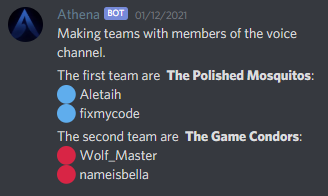

# Athena

Discord bot for Overwatch. 

Originally developed for the 🐒 Embrace Monke 🐒 server.

## Features

* Overwatch profile image generator, powered by the [Overwatch API](https://ow-api.com/)
    * Main hero detection
    * Total games and hours
    * Competitive stats if present
    * Random background
    * Private profile
* Associating Battle.net users with Discord users.
* Make balanced teams of up to 6 vs. 6 players in voice channels and text channels, with observers.
* Pseudo-NL interface.

## Example

### Profile image generator

Bots can't read linked accounts on a Discord profile, so you must link a Discord user with a Battle.Net account manually. These are case sensitive.

> Athena, remember me as fixmycode#1699

> Athena, remember @WolfMaster as MasterWolf#11466

You can then ask Athena to show you your profile or any user stored in her memory

> Athena, show me my profile

> Athena, show me @fixmycode


The data is cached so if you want to have new results you need to ask her to refresh

> Athena, show me my profile but refresh first

### Teams

You can ask Athena to sort the members of a voice chat in teams of up to 6 vs. 6 players. Athena will choose equal number of people in each team and set observers for that match if she can't divide them.

> Athena, make teams



If you're not on a voice channel, Athena will look for people on the text channel that are playing Overwatch.

In the future, Athena will look into her database for role information to setup a 2-2-2 team composition.

## Running

Poetry must be installed if you want to run from source

```bash
export DISCORD_TOKEN=asdfgh12344 
poetry run bot
```