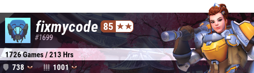

# Athena

Discord bot for Overwatch. 

Originally developed for the 🐒 Embrace Monke 🐒 server.

## Features

* Overwatch profile image generator, powered by the [Overwatch API](https://ow-api.com/)
    * Main hero detection
    * Total games and hours
    * Competitive stats if present
    * Random background
    * Private profile
* Associating Battle.net users with Discord users.
* Pseudo-NL interface.

## Example

> Athena, remember me as fixmycode#1699

> Athena, show me my profile



## Running

Poetry must be installed if you want to run from source

```bash
export DISCORD_TOKEN=asdfgh12344 
poetry run bot
```